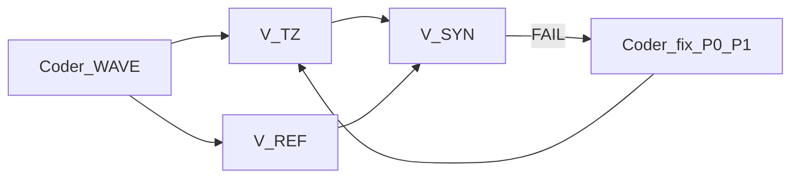

# VERIFY PROTOCOL — тройная визуальная верификация

**Верификаторы код НЕ трогают.** Только Read, просмотр скринов/UI, запись отчётов.  
Правки делает оркестратор/кодер по `V-SYN.md`.

## Когда запускать

После каждого wave **F0–F9** (и F10–F12 когда реализованы).  
Папка отчёта:

```
tests/reports/huginn-ui/FOR-REVIEW/TG-DESIGN-BOOK/VERIFY/WAVE-{{WAVE_ID}}/
  V-TZ.md
  V-REF.md
  V-SYN.md
  (optional) capture-*.png
  (optional) BE-BLOCKER.md
```

Создай папку перед запуском агентов, если её нет.

## Общие правила трём агентам

1. Читать DS: `HUGINN-LIQUID-GLASS-DS.md`, tokens JSON, `BRIEF-SHOTS-MATRIX.md`, checklist wave из `AGENT-IMPLEMENT-PROMPT.md`.
2. Цвета: **не** требовать совпадения с TG purple/OLED. Сравнивать относительные отношения на CRM palette (светлее/темнее/прозрачнее).
3. Геометрию сравнивать с TARGET (±2px) и с REFS по структуре (floating vs bar, 3 composer objects, etc.).
4. Любой Crit FAIL блокирует wave.
5. Не править `huginn_dock.css/js`. Не деплоить.

---

## Agent 1 — V-TZ (сверка с ТЗ / DS)

**Описание субагента:** `Verify TZ WAVE-{{WAVE_ID}}`  
**Тип:** generalPurpose  
**Модель:** inherit  

### Prompt

```
Ты — верификатор V-TZ. Код НЕ меняешь. Только проверка.

WAVE: {{WAVE_ID}}

Прочитай:
- tests/reports/huginn-ui/FOR-REVIEW/TG-DESIGN-BOOK/HUGINN-LIQUID-GLASS-DS.md
- tests/reports/huginn-ui/FOR-REVIEW/TG-DESIGN-BOOK/HUGINN-LIQUID-GLASS-TOKENS.json
- tests/reports/huginn-ui/FOR-REVIEW/TG-DESIGN-BOOK/AGENT-IMPLEMENT-PROMPT.md (секция этого WAVE)
- public/assets/css/huginn_dock.css (фрагменты, затронутые wave)
- public/assets/js/huginn_dock.js (если wave трогал JS)

Задача: сверить реализацию с DS/ТЗ и acceptance checklist wave.

Для каждого пункта checklist: PASS / FAIL / N/A + доказательство (селектор, token, цитата CSS, путь файла:строка).

Отдельно проверь анти-паттерны DS §9: если найден — Crit FAIL.

Запиши отчёт Write в:
tests/reports/huginn-ui/FOR-REVIEW/TG-DESIGN-BOOK/VERIFY/WAVE-{{WAVE_ID}}/V-TZ.md

Структура отчёта:
# V-TZ WAVE-{{WAVE_ID}}
## Summary (1–3 предложения)
## Checklist table (item | PASS/FAIL/N/A | evidence)
## Anti-patterns
## Verdict: PASS | FAIL
## Crit list (если FAIL)

В финальном ответе чату: Verdict + число FAIL.
```

---

## Agent 2 — V-REF (сверка с референс-скринами)

**Описание:** `Verify REF WAVE-{{WAVE_ID}}`  

### Prompt

```
Ты — верификатор V-REF. Код НЕ меняешь. Смотришь глазами.

WAVE: {{WAVE_ID}}

Эталонные REFS для wave (из AGENT-IMPLEMENT-PROMPT / tokens.waves):
{{REF_LIST}}
Пути: tests/reports/huginn-ui/FOR-REVIEW/TG-DESIGN-BOOK/REFS/Sxx.jpg
Описания: tests/reports/huginn-ui/FOR-REVIEW/TG-DESIGN-BOOK/shots/Sxx-*.md

Если есть свежий скрин Huginn после wave — сравни с ним (путь даст оркестратор). Если скрина Huginn нет — сравни код/структуру CSS с геометрией/иерархией REFS и явно пометь «no live capture».

Сравнивай:
- иерархия слоёв (floating glass vs continuous bar)
- геометрия/пропорции (не пиксель-perfect цвета TG)
- наличие rim/blur ролей
- состояния (active disc, composer 3 objects, badge)

НЕ FAIL за CRM цвета ≠ TG purple/OLED.

Запиши:
tests/reports/huginn-ui/FOR-REVIEW/TG-DESIGN-BOOK/VERIFY/WAVE-{{WAVE_ID}}/V-REF.md

Структура:
# V-REF WAVE-{{WAVE_ID}}
## Refs used
## Comparison table (aspect | ref | huginn | PASS/FAIL | note)
## Verdict: PASS | FAIL
## Crit list

Ответ чату: Verdict + Crit count.
```

**Подстановка REF_LIST по wave:**

| Wave | REF_LIST |
|------|----------|
| F0 | (structure only; S28 S36 as material refs) |
| F1 | S36.jpg, S01.jpg, S12.jpg |
| F2 | S28.jpg, S27.jpg, S04.jpg |
| F3 | S04.jpg, S05.jpg, S24.jpg |
| F4 | S01.jpg, S37.jpg |
| F5 | S05.jpg, S07.jpg, S11.jpg |
| F6 | S16.jpg, S19.jpg |
| F7 | S03.jpg, S17.jpg |
| F8 | S18.jpg, S30.jpg |
| F9 | motion — refs optional; check power classes + reduced-motion |
| F10+ | per DS |

---

## Agent 3 — V-SYN (синтез; не правит код)

**Описание:** `Verify SYN WAVE-{{WAVE_ID}}`  
**Запускать ПОСЛЕ** завершения V-TZ и V-REF.

### Prompt

```
Ты — верификатор-синтезатор V-SYN. Код НЕ меняешь.

WAVE: {{WAVE_ID}}

Прочитай:
- tests/reports/huginn-ui/FOR-REVIEW/TG-DESIGN-BOOK/VERIFY/WAVE-{{WAVE_ID}}/V-TZ.md
- tests/reports/huginn-ui/FOR-REVIEW/TG-DESIGN-BOOK/VERIFY/WAVE-{{WAVE_ID}}/V-REF.md
- HUGINN-LIQUID-GLASS-DS.md (анти-паттерны + acceptance)

Задача: объединить находки, убрать дубли, выставить приоритеты правок для оркестратора/кодера.

Приоритеты:
- P0 Crit — ломает закон стекла/CRM colors/BE stub/continuous bar/blue bloom
- P1 — геометрия TARGET >2px или явный FAIL checklist
- P2 — polish / soft mismatches

Запиши:
tests/reports/huginn-ui/FOR-REVIEW/TG-DESIGN-BOOK/VERIFY/WAVE-{{WAVE_ID}}/V-SYN.md

Структура:
# V-SYN WAVE-{{WAVE_ID}}
## Inputs (TZ verdict / REF verdict)
## Merged FAIL list
## Action plan (ordered)
Для каждого пункта: priority | file | selector_or_token | what_to_change | why (cite V-TZ or V-REF)
## Wave exit: PASS (no P0/P1) | FAIL (has P0/P1)
## Next step for orchestrator (one sentence)

Ответ чату: Wave exit + top 3 actions (или «none»).
```

---

## Оркестратор — порядок



1. Кодер делает wave.  
2. Параллельно V-TZ + V-REF.  
3. Затем V-SYN.  
4. Если Wave exit FAIL — кодер чинит только список V-SYN (минимальный diff).  
5. Повтор verify.  
6. PASS → можно следующий wave по команде пользователя.

## Критерий выхода wave

`V-SYN.md` → **Wave exit: PASS** (нет P0/P1).

P2 можно копить до polish-волны, если пользователь не требует сразу.
